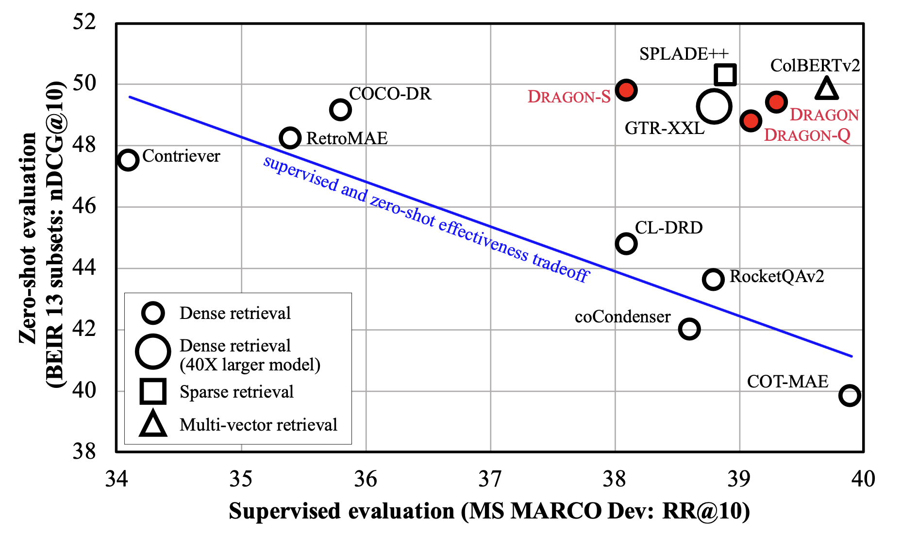

# How to Train Your DRAGON: Diverse Augmentation Towards Generalizable Dense Retrieval
<p align="center">
  
</p>
<p align="center">
  <b>Figure 1:</b> Supervised versus zero-shot effectiveness comparison among existing state-of-the-art retrievers.
</p>

This page describes how to train your DRAGON to break the supervised and zero-shot effectiveness tradeoff with a BERT-based size model with dpr-scale on AWS cluster. If you are a user for dense retrieval model, you can try it by easily switching your model with our provided hugging face models. In brief, we use MS MARCO corpus to create large-scale training data with cropped sentences and neural generative queries. In addition, we improve the quality of training data using multiple retrievers to conduct automatical relevance labeling for the augmented queries. See more detail in our paper, [How to Train Your DRAGON: Diverse Augmentation Towards Generalizable Dense Retrieval](https://arxiv.org/abs/2302.07452).

In the following, we describe how to train, encode and retrieve with DRAGON on MS MARCO passage-v1 and BEIR datasets.
1. Install [Dependencies](#dependency)
1. [MS MARCO Passage-v1 Data Preparation](#msmarco_data_prep)
1. [Data Augmentation for DRAGON Training](#msmarco_data_augmentation)
    1. [MSMARCO Query Augmentation](#msmarco_qry_augmentation)
    1. [MSMARCO Relevance Label Augmentation](#msmarco_label_augmentation)
1. [DRAGON Training](#dragon_training)
1. [DRAGON Evaluation on MS MARCO](#dragon_msmarco_eval)
1. [DRAGON Evaluation on BEIR](#dragon_beir_eval)
1. Huggingface Checkpoints

Model | Initialization | MARCO Dev | BEIR | CKPT Download | Huggingface Path: Query Encoder | Huggingface Path: Context Encoder 
|---|---|---|---|---|---|---
DRAGON+ | [RetroMAE](https://huggingface.co/Shitao/RetroMAE) | 39.0 | 47.4 | [Download](https://dl.fbaipublicfiles.com/dragon/checkpoints/DRAGON-Plus/checkpoint_best.ckpt) | [facebook/dragon-plus-query-encoder](https://huggingface.co/facebook/dragon-plus-query-encoder) | [facebook/dragon-plus-context-encoder](https://huggingface.co/facebook/dragon-plus-context-encoder)
DRAGON-RoBERTa | [RoBERTa-base](https://huggingface.co/roberta-base) | 39.4 | 47.2  | [Download](https://dl.fbaipublicfiles.com/dragon/checkpoints/DRAGON-RoBERTa/checkpoint_best.ckpt) | [facebook/dragon-roberta-query-encoder](https://huggingface.co/facebook/dragon-roberta-query-encoder) | [facebook/dragon-roberta-context-encoder](https://huggingface.co/facebook/dragon-roberta-context-encoder)
DRAGON | [BERT-base](https://huggingface.co/bert-base-uncased) | 39.3 | 46.6 | [Download](https://dl.fbaipublicfiles.com/dragon/checkpoints/DRAGON/checkpoint_best.ckpt) | - | -
DRAGON-S | [BERT-base](https://huggingface.co/bert-base-uncased) | 38.1 | 46.8 | [Download](https://dl.fbaipublicfiles.com/dragon/checkpoints/DRAGON-S/checkpoint_best.ckpt) | - | -
DRAGON-Q | [BERT-base](https://huggingface.co/bert-base-uncased) | 39.1 | 45.8 | [Download](https://dl.fbaipublicfiles.com/dragon/checkpoints/DRAGON-Q/checkpoint_best.ckpt) | - | -

## Dependencies <a name="dependency"></a>
First, make sure you have [Anaconda3](https://docs.anaconda.com/anaconda/install/index.html) installed.
Then use conda to create a new environment and activate it:
```
conda create -n dpr-scale python=3.8
conda activate dpr-scale
```
Now let's install the packages. First, follow the instructions [here](https://pytorch.org/get-started/locally/) to install PyTorch on your machine.
Pytorch 1.12.1 and CUDA 11.6 are used in our experiments.

Then install faiss:
```
conda install -c conda-forge faiss-gpu
```
Finally install the packages in `requirement.txt`. Remember to comment out the packages in the .txt file that you've already installed to avoid conflicts.
```
pip install -r requirements.txt
```

## MS MARCO Passage-v1 Data Preparation <a name="msmarco_data_prep"></a>
First, download and decompress the data from the [MS MARCO](https://microsoft.github.io/msmarco/TREC-Deep-Learning-2019) official website. We use the training data from [qidpidtriples.train.full.2.tsv.gz](https://msmarco.blob.core.windows.net/msmarcoranking/qidpidtriples.train.full.2.tsv.gz) and [collectionandqueries.tar.gz](https://msmarco.blob.core.windows.net/msmarcoranking/collectionandqueries.tar.gz).

We transform the corpus file `collection.tsv` into dpr-scale corpus format by adding header.
```
awk -F "\t" 'BEGIN{print "id\ttext\ttitle"}1 {print $1"\t"$2"\t dummy"}' <corpus file path> > $YOUR_MSMRCO_FOLDER/collection.tsv
```

Then, generate the training data using `qidpidtriples.train.full.2.tsv` and `queries.train.tsv`. 
```
PYTHONPATH=. python dragon/data_prep/prep_msmarco_train.py --qidpidtriples_path <qidpidtriples file path> --query_file_path <query file path> --json_output_dir $YOUR_MSMRCO_FOLDER
```

### MSMARCO Baseline DPR Training
Now you can see `$YOUR_MSMRCO_FOLDER/official_train.jsonl` and `$YOUR_MSMRCO_FOLDER/dev.jsonl` and by default we use 1\% training queries as the development set while training. With the train and dev file, you can now try a baseline DPR training on MS MARCO dataset with single GPU.
```
PYTHONPATH=.:$PYTHONPATH python dpr_scale/main.py -m --config-name msmarco_baseline.yaml \
datamodule.corpus_path=$YOUR_MSMRCO_FOLDER/collection.tsv \
datamodule.train_path=[$YOUR_MSMRCO_FOLDER/official_train.jsonl] \
datamodule.val_path=$YOUR_MSMRCO_FOLDER/dev.jsonl \
datamodule.test_path=$YOUR_MSMRCO_FOLDER/dev.jsonl \
task.transform.max_seq_len=128
```

## Data Augmentation for DRAGON Training <a name="msmarco_data_augmentation"></a>


Our training data can be downloaded at:
<table>
  <tr>
    <td> <b>Query Only</b> </td>
    <td colspan="5" align="center"> <b>Training Data with Labels</b> </td>
  </tr>
  <tr>
    <td></td>
    <td><b>UniCOIL</b></td>
    <td><b>Contriever</b></td>
    <td><b>GTR-XXL</b></td>
    <td><b>ColBERT-v2</b></td>
    <td><b>SPLADE++</b></td>
  </tr>  
  <tr>
    <td> <a href="https://dl.fbaipublicfiles.com/dragon/data/queries/queries.sentence.train.tsv">sentences</a> </td>
    <td> <a href="https://dl.fbaipublicfiles.com/dragon/data/labels/uniCOIL.sentence.train.jsonl">Download</a> </td>
    <td> <a href="https://dl.fbaipublicfiles.com/dragon/data/labels/contriever-msmarco.sentence.train.jsonl">Download</a> </td>
    <td> <a href="https://dl.fbaipublicfiles.com/dragon/data/labels/gtr-xxl.sentence.train.jsonl">Download</a> </td>
    <td> <a href="https://dl.fbaipublicfiles.com/dragon/data/labels/colbertv2.sentence.train.jsonl">Download</a> </td>
    <td> <a href="https://dl.fbaipublicfiles.com/dragon/data/labels/splade.sentence.train.jsonl">Download</a> </td>
  </tr>
  <tr>
    <td> <a href="https://dl.fbaipublicfiles.com/dragon/data/queries/queries.doct5query.train.tsv">docT5query</a> </td>
    <td> <a href="https://dl.fbaipublicfiles.com/dragon/data/labels/uniCOIL.doct5query.train.jsonl">Download</a> </td>
    <td> <a href="https://dl.fbaipublicfiles.com/dragon/data/labels/contriever-msmarco.doct5query.train.jsonl">Download</a> </td>
    <td> <a href="https://dl.fbaipublicfiles.com/dragon/data/labels/gtr-xxl.doct5query.train.jsonl">Download</a> </td>
    <td> <a href="https://dl.fbaipublicfiles.com/dragon/data/labels/colbertv2.doct5query.train.jsonl">Download</a> </td>
    <td> <a href="https://dl.fbaipublicfiles.com/dragon/data/labels/splade.doct5query.train.jsonl">Download</a> </td>
  </tr>
</table>

Below we describe how the training data is generated.

### MSMARCO Query Augmentation <a name="msmarco_qry_augmentation"></a>
In this project, we scale up the size of training data using augmented queries from sentence cropping and synthetic queries. For sentence cropping, we use the following script to crop sentences from msmarco passage corpus, resulting in 28,545,938 queries.
```
PYTHONPATH=. python dragon/data_prep/crop_sentence.py --workers 16 --doc_path $YOUR_MSMRCO_FOLDER/collection.tsv --output_dir_path $YOUR_MSMRCO_FOLDER/queries.sentence.train.tsv
```

For synthetic queries, we directly get the [doct5query](https://github.com/castorini/docTTTTTquery) generated queries from the [link](https://www.dropbox.com/s/uzkvv4gpj3a596a/predicted_queries_topk_sampling.zip?dl=1). Note that we randomly sample 28,545,938 sythetic quereis from the pool and form the query file `queries.doct5query.train.tsv` with the format `{qid}\t{query_text}` by assigning dummy `qid` (start from 0) for each query.

### MSMARCO Relevance Label Augmentation <a name="msmarco_label_augmentation"></a>
Here, we use contriever to conduct relevance label augmentation on the sentence queries just created (`$YOUR_MSMRCO_FOLDER/queries.sentence.train.tsv`) and generate the training data as an example. Note that to speed up the process, you may want to split the query file into segments and generate the query embeddings and conduct retrieval using multiple GPUs; then merge the results.
```
# Generate Document Embeddings
PYTHONPATH=.:$PYTHONPATH python dpr_scale/generate_embeddings.py -m \
datamodule=generate \
datamodule.test_path=$YOUR_MSMRCO_FOLDER/collection.tsv \
datamodule.test_batch_size=64 \
datamodule.use_title=False \
task.transform.max_seq_len=128 \
task.model.model_path=facebook/contriever-msmarco \
+task.ctx_embeddings_dir=$YOUR_MSMRCO_FOLDER/contriever-msmarco/ctx_embeddings \
trainer.gpus=1 \

# Generate Query Embeddings
PYTHONPATH=.:$PYTHONPATH python dpr_scale/generate_query_embeddings.py -m \
datamodule=generate_query_emb \
+datamodule.test_path=$YOUR_MSMRCO_FOLDER/queries.sentence.train.tsv \
+datamodule.trec_format=True \
+task.ctx_embeddings_dir=$YOUR_MSMRCO_FOLDER/qry_embeddings \
datamodule.test_batch_size=64 \
task.transform.max_seq_len=128 \
task.model.model_path=facebook/contriever-msmarco \
trainer.gpus=1 \

# Retrieval
PYTHONPATH=.:$PYTHONPATH python dpr_scale/run_retrieval_pytorch.py \
--ctx_embeddings_dir=$YOUR_MSMRCO_FOLDER/contriever-msmarco/ctx_embeddings \
--query_emb_path=$YOUR_MSMRCO_FOLDER/qry_embeddings/query_reps.pkl \
--questions_tsv_path=$YOUR_MSMRCO_FOLDER/queries.sentence.train.tsv \
--passages_tsv_path=$YOUR_MSMRCO_FOLDER/collection.tsv \
--output_runfile_path=$YOUR_MSMRCO_FOLDER/contriever-msmarco/sentence.train.trec \
--trec_format \
--topk=50 \
```
With the ranking list `$YOUR_MSMRCO_FOLDER/contriever-msmarco/sentence.train.trec`, we can contruct training data by using the top 10 and top45-50 as positives and negatives.
```
python dragon/data_prep/convert_trec_to_train.py \
--query_tsv_path $YOUR_MSMRCO_FOLDER/queries.sentence.train.tsv \
--trec_in_path $YOUR_MSMRCO_FOLDER/contriever-msmarco/sentence.train.trec \
--json_out_path $YOUR_MSMRCO_FOLDER/contriever-msmarco.sentence.train.jsonl
```
And you can generate `$YOUR_MSMRCO_FOLDER/contriever-msmarco.doct5query.train.jsonl` with doct5query generated queries following the same procedure. For sparse retrieval, we follow the instruction in [anserini](https://github.com/castorini/anserini) to conduct retieval for the augmented queries for [uniCOIL](https://github.com/castorini/anserini/blob/master/docs/regressions-msmarco-passage-unicoil.md) and [SPLADE++](https://github.com/castorini/anserini/blob/master/docs/regressions-msmarco-passage-splade-distil-cocodenser-medium.md). For GTR-XXL, we use [sentence transformer](https://github.com/UKPLab/sentence-transformers) to first encode query and passage embeddings (see [instruction](https://huggingface.co/sentence-transformers/gtr-t5-xxl)); then conduct retrieval using the above script. Finally, for ColBERTv2, we follow the instruction in [PLAID](https://github.com/stanford-futuredata/ColBERT). Note that you need convert the ranking file from PLAID into trec format by yourself. 

## DRAGON Training <a name="dragon_training"></a>
### Training with Mixed Queries
To train DRAGON with uniCOIL supervsion on SLURM, run:
```
PATH_TO_TRAIN_JSON0=$YOUR_MSMRCO_FOLDER/uniCOIL.sentence.train.jsonl
PATH_TO_TRAIN_JSON1=$YOUR_MSMRCO_FOLDER/uniCOIL.doct5query.train.jsonl
PATH_TO_CORPUS_TSV=$msmarco_corpus

PYTHONPATH=.:$PYTHONPATH nohup python dpr_scale/main.py -m --config-name dragon_aws.yaml \
datamodule.corpus_path=$YOUR_MSMRCO_FOLDER/collection.tsv \
datamodule.train_path=[$PATH_TO_TRAIN_JSON0, $PATH_TO_TRAIN_JSON1] \
datamodule.val_path=$YOUR_MSMRCO_FOLDER/dev.jsonl \
datamodule.test_path=$YOUR_MSMRCO_FOLDER/dev.jsonl \
task.transform.max_seq_len=128 \
```
You could found the output at `/fsx/${env:USER}/hydra_outputs/${hydra.launcher.name}/${now:%Y-%m-%d-%H%M%S}` (specified in the `dpr-scale/conf/trainer/slurm-aws.yaml`).

### Training with Progressive Supervision
We then further add the training data with relevance labels from Contriever in `train_path` in the second iteration.
```
PATH_TO_TRAIN_JSON0=$YOUR_MSMRCO_FOLDER/uniCOIL.sentence.train.jsonl
PATH_TO_TRAIN_JSON1=$YOUR_MSMRCO_FOLDER/uniCOIL.doct5query.train.jsonl
PATH_TO_TRAIN_JSON2=$YOUR_MSMRCO_FOLDER/contriever-msmarco.sentence.train.jsonl
PATH_TO_TRAIN_JSON3=$YOUR_MSMRCO_FOLDER/contriever-msmarco.doct5query.train.jsonl
PEVIOUS_CHECKPOINT_PATH=<LAST_CHECKPOINT>

PYTHONPATH=.:$PYTHONPATH nohup python dpr_scale/main.py -m --config-name dragon_aws.yaml \
datamodule.corpus_path=$YOUR_MSMRCO_FOLDER/collection.tsv \
datamodule.train_path=[$PATH_TO_TRAIN_JSON0, $PATH_TO_TRAIN_JSON1, $PATH_TO_TRAIN_JSON2,, $PATH_TO_TRAIN_JSON3] \
datamodule.val_path=$YOUR_MSMRCO_FOLDER/dev.jsonl \
datamodule.test_path=$YOUR_MSMRCO_FOLDER/dev.jsonl \
task.transform.max_seq_len=128 \
+task.pretrained_checkpoint_path=$PEVIOUS_BEST_CHECKPOINT_PATH
```
Following the same procedure, we further add the training data created by GTR-XXL, ColBERTv2, SPLADE++ in the third, fourth and final iteration, respectively. 

## DRAGON Evaluation on MS MARCO <a name="dragon_msmarco_eval"></a>
### Generate embeddings
The below script is to generate embeddings using local GPUs with 1 GPUs. You can set more GPU number.
```
# Generate Document Embeddings
PYTHONPATH=.:$PYTHONPATH python dpr_scale/generate_embeddings.py -m \
datamodule=generate \
datamodule.test_path=$YOUR_MSMRCO_FOLDER/collection.tsv \
datamodule.test_batch_size=64 \
datamodule.use_title=False \
task.transform.max_seq_len=128 \
+task.ctx_embeddings_dir=$YOUR_MSMRCO_FOLDER/embeddings/ctx \
+task.checkpoint_path=<DRAGON_CKPT> \
trainer.gpus=1 \

# Generate Query Embeddings
PYTHONPATH=.:$PYTHONPATH python dpr_scale/generate_query_embeddings.py -m \
datamodule=generate_query_emb \
+datamodule.test_path=$YOUR_MSMRCO_FOLDER/queries.dev.small.tsv \
+datamodule.trec_format=True \
+task.ctx_embeddings_dir=$YOUR_MSMRCO_FOLDER/embeddings/qry \
datamodule.test_batch_size=64 \
task.transform.max_seq_len=$MAX_Q_LEN \
+task.checkpoint_path=<DRAGON_CKPT> \
trainer.gpus=1 \
```

### Run retrieval and evaluaiton
For evaluation, we folow the [instruction](https://github.com/castorini/anserini-tools/tree/95fbaf2af75e2b59304ac5702d5479d50f3bd9ef) to build trec_eval.9.0.4 so that we do not have to install any package for evaluation.
```
PATH_TO_RUNFILE=<DEFINE_BY_YOURSELF>

PYTHONPATH=.:$PYTHONPATH python dpr_scale/run_retrieval_pytorch.py \
--ctx_embeddings_dir=$YOUR_MSMRCO_FOLDER/embeddings/ctx \
--query_emb_path=$YOUR_MSMRCO_FOLDER/embeddings/qry/query_reps.pkl \
--questions_tsv_path=$YOUR_MSMRCO_FOLDER/queries.dev.small.tsv \
--passages_tsv_path=$YOUR_MSMRCO_FOLDER/collection.tsv \
--output_runfile_path=$PATH_TO_RUNFILE \
--trec_format \
--topk=1000

./eval/trec_eval.9.0.4/trec_eval -c -M 10 -m recip_rank $YOUR_MSMRCO_FOLDER/qrels.dev.small.tsv $PATH_TO_RUNFILE
./eval/trec_eval.9.0.4/trec_eval -c -m ndcg_cut.10 $YOUR_MSMRCO_FOLDER/qrels.dev.small.tsv $PATH_TO_RUNFILE
./eval/trec_eval.9.0.4/trec_eval -c -m recall.100,1000 $YOUR_MSMRCO_FOLDER/qrels.dev.small.tsv $PATH_TO_RUNFILE
```

## DRAGON Evaluation on BEIR <a name="dragon_beir_eval"></a>
We first download BEIR dataset from its [github](https://github.com/beir-cellar/beir). Here we use the nfcorpus dataset as an example.
### Data Preprocess
We first download decompress the dataset; then, using our script to transform the corpus and query file into dpr-scale format. We also transform the `qrels.test.tsv` into trec qrel fromat. Note that when runing `dpr_scale/run_retrieval_pytorch.py` for `arguana` and `quora`, please turn on `--ignore_identical_ids`.
```
# data download and decompress
mkdir $YOUR_BEIR_FOLDER
cd $YOUR_BEIR_FOLDER
wget https://public.ukp.informatik.tu-darmstadt.de/thakur/BEIR/datasets/nfcorpus.zip
unzip nfcorpus.zip
cd ..

# data preprocess
python dragon/data_prep/prep_beir_eval.py --data_dir $YOUR_BEIR_FOLDER/nfcorpus
```
### Generate embeddings
```
# variable
TASK=beir
SET=test
CORPUS=nfcorpus
MAX_D_LEN=512
MAX_Q_LEN=512
OUTPUT_PATH=<YOUR_FOLDER>

# Generate Document Embeddings
PATH_TO_CORPUS_TSV=$TASK/$CORPUS/collection.tsv
CTX_EMBEDDINGS_DIR=$OUTPUT_PATH/embeddings/$TASK.$CORPUS.collectiopn

HYDRA_FULL_ERROR=1 PYTHONPATH=.:$PYTHONPATH python dpr_scale/generate_embeddings.py -m \
datamodule=generate \
datamodule.test_path=$YOUR_BEIR_FOLDER/nfcorpus/collection.tsv \
datamodule.test_batch_size=64 \
datamodule.use_title=True \
task.transform.max_seq_len=512 \
+task.ctx_embeddings_dir=$YOUR_BEIR_FOLDER/nfcorpus/embeddings/ctx \
+task.checkpoint_path=<DRAGON_CKPT> \
trainer.gpus=1 \

# Generate Query Embeddings
PATH_TO_QUERIES_TSV=$TASK/$CORPUS/queries.$SET.tsv
QRY_EMBEDDINGS_PATH=$OUTPUT_PATH/embeddings/queries/$TASK.$CORPUS.$SET.pkl

PYTHONPATH=.:$PYTHONPATH python dpr_scale/generate_query_embeddings.py -m \
datamodule=generate_query_emb \
+datamodule.test_path=$YOUR_BEIR_FOLDER/nfcorpus/queries.test.tsv \
+datamodule.trec_format=True \
+task.ctx_embeddings_dir=$YOUR_BEIR_FOLDER/nfcorpus/embeddings/qry \
datamodule.test_batch_size=64 \
task.transform.max_seq_len=512 \
+task.checkpoint_path=<DRAGON_CKPT> \
trainer.gpus=1 \
```

### Run retrieval and evaluaiton
```
PATH_TO_RUNFILE=<DEFINE_BY_YOURSELF>

if [ $CORPUS == `arguana` ] || [ $CORPUS == `quora` ]
then
PYTHONPATH=.:$PYTHONPATH python dpr_scale/run_retrieval_pytorch.py \
--ctx_embeddings_dir=$YOUR_BEIR_FOLDER/nfcorpus/embeddings/ctx \
--query_emb_path=$YOUR_BEIR_FOLDER/nfcorpus/embeddings/qry/query_reps.pkl \
--questions_tsv_path=$YOUR_BEIR_FOLDER/nfcorpus/queries.tsv.tsv \
--passages_tsv_path=$YOUR_BEIR_FOLDER/nfcorpus/collection.tsv \
--output_runfile_path=$PATH_TO_RUNFILE \
--trec_format \
--topk=1000 \
--ignore_identical_ids
else
PYTHONPATH=.:$PYTHONPATH python dpr_scale/run_retrieval_pytorch.py \
--ctx_embeddings_dir=$YOUR_BEIR_FOLDER/nfcorpus/embeddings/ctx \
--query_emb_path=$YOUR_BEIR_FOLDER/nfcorpus/embeddings/qry/query_reps.pkl \
--questions_tsv_path=$YOUR_BEIR_FOLDER/nfcorpus/queries.test.tsv \
--passages_tsv_path=$YOUR_BEIR_FOLDER/nfcorpus/collection.tsv \
--output_runfile_path=$PATH_TO_RUNFILE \
--trec_format \
--topk=1000
fi

./eval/trec_eval.9.0.4/trec_eval -c -M 10 -m recip_rank $YOUR_BEIR_FOLDER/nfcorpus/qrels.test.tsv $PATH_TO_RUNFILE
./eval/trec_eval.9.0.4/trec_eval -c -m ndcg_cut.10 $YOUR_BEIR_FOLDER/nfcorpus/qrels.test.tsv $PATH_TO_RUNFILE
./eval/trec_eval.9.0.4/trec_eval -c -m recall.100,1000 $YOUR_BEIR_FOLDER/nfcorpus/qrels.test.tsv $PATH_TO_RUNFILE
```

## Citing

To cite this work, please use the following bibtex:
```
@article{lin_dragon_2023,
	title = How to Train Your DRAGON: Diverse Augmentation Towards Generalizable Dense Retrieval,
	url = {https://arxiv.org/abs/2302.07452},
	publisher = {arXiv},
	journal = {arXiv e-print 2302.07452},
	author = {Sheng-Chieh Lin, Akari Asai, Minghan Li, Barlas Oguz, Jimmy Lin, Yashar Mehdad, Wen-tau Yih, Xilun Chen},
	year = {2023},
}
```

## License
dpr-scale is CC-BY-NC 4.0 licensed as of now.
