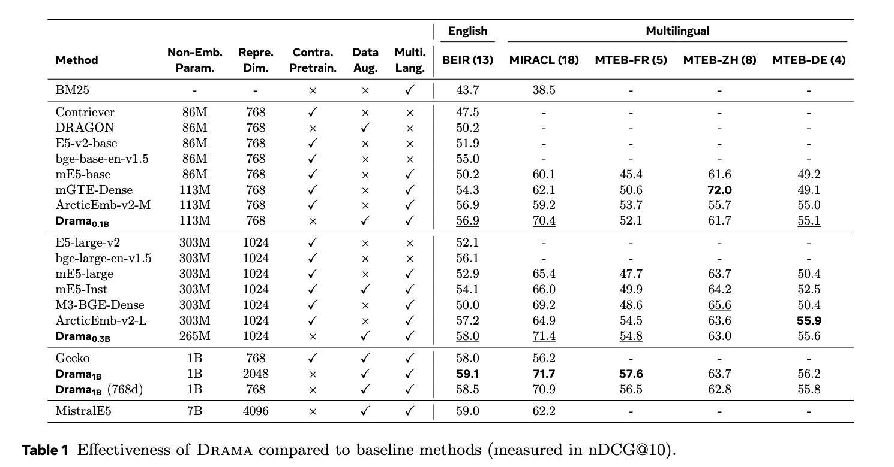

# DRAMA: Diverse Augmentation from Large Language Models to Smaller Dense Retrievers

DRAMA is a series of smaller dense retrieval models with non-embedding parameter sizes of 0.1B, 0.3B, and 1B. It is derived by pruning a large language model and fine-tuned for efficient and generalizable multilingual text retrieval.
By leveraging large language models for high-quality data augmentation, DRAMA achieves strong performance across both English and multilingual retrieval tasks.

Please check our [paper](https://arxiv.org/abs/2502.18460) for the detials.

## Checkpoints

| Model       | Size  | BEIR-13  | MIRACL-18 | MLDR  | Hugging Face Link |
|------------|-------|-------|--------|-------|-------------------|
| `drama-base` | 0.1B  | 56.9     | 70.4      | 47.1     | [facebook/drama-base](https://huggingface.co/facebook/drama-base) |
| `drama-large`| 0.3B  | 58.0     | 71.4      | 48.8     | [facebook/drama-large](https://huggingface.co/facebook/drama-large) |
| `drama-1b`   | 1B    | 59.1     | 71.7      | 54.8     | [facebook/drama-1b](https://huggingface.co/facebook/drama-1b) |


## Usage

Below is an example using `drama-base` to encode query and document examples from the MIRACL dataset:
```python
import torch
from transformers import AutoTokenizer, AutoModel


queries = [
    'What percentage of the Earth\'s atmosphere is oxygen?',
    '意大利首都是哪里？',
]
documents = [
    "The amount of oxygen in the atmosphere has fluctuated over the last 600 million years, reaching a peak of 35% during the Carboniferous period, significantly higher than today's 21%.",
    "羅馬是欧洲国家意大利首都和罗马首都广域市的首府及意大利全国的政治、经济、文化和交通中心，位于意大利半島中部的台伯河下游平原地，建城初期在七座小山丘上，故又名“七丘之城”。按城市范围内的人口计算，罗马是意大利人口最多的城市，也是欧盟人口第三多的城市。",
]

model_name = "facebook/drama-base"
device = "cuda" if torch.cuda.is_available() else "cpu"
tokenizer = AutoTokenizer.from_pretrained(model_name)
model = AutoModel.from_pretrained(model_name, trust_remote_code=True).to(device)

query_embs = model.encode_queries(tokenizer, queries)
doc_embs = model.encode_documents(tokenizer, documents)

scores = query_embs @ doc_embs.T
print(scores.tolist())
# Expected output: [[0.5310, 0.0821], [0.1298, 0.6181]]
```


> The `trust_remote_code` will use our customized `drama_modeling.py` with two details:
>- We use bi-directional attention instead of uni-directional attention
>- We add `"Query: "` as prefix for query text. (No prefix added to document)


DRAMA models are trained using Matryoshka Representation Learning ([MRL](https://github.com/RAIVNLab/MRL)) to support flexible dimensionality. Both queries and documents can be encoded into smaller dimensions, such as 256, using the following:

```python
query_embs = model.encode_queries(tokenizer, queries, dim=256)
doc_embs = model.encode_documents(tokenizer, documents, dim=256)

scores = query_embs @ doc_embs.T
print(scores.tolist())
# Expected output: [[0.6031, 0.1750], [0.2005, 0.7251]]
```

## Evaluation

The model has been evaluated on multiple retrieval benchmarks, including [BEIR](https://github.com/beir-cellar/beir), [MIRACL](https://github.com/project-miracl/miracl), [MLDR](https://huggingface.co/datasets/Shitao/MLDR), and several multilingual retrieval tasks in [MTEB](https://github.com/embeddings-benchmark/mteb).
It demonstrates strong performance in both English and multilingual retrieval tasks.

<p align="center">
  
</p>


## Supported Languages
DRAMA was initialized from [Llama3.2-1B](https://huggingface.co/meta-llama/Llama-3.2-1B) (which was originally pruned from [Llama3.1-8B](https://huggingface.co/meta-llama/Llama-3.1-8B)). During pruning and retriever training, training data covered the following 20 languages (sorted alphabetically):

`Arabic, Bengali, Chinese, English, Finnish, French, German, Hindi, Indonesian, Italian, Japanese, Korean, Persian, Portuguese, Russian, Spanish, Swahili, Telugu, Thai, Yoruba`

Other languages may have downgraded peformance.

## Training
DRAMA is trained using the DRAGON codebase from this `dpr-scale` repository. 
To prepare the training data and corpus file, please follow the method discussed in the paper to generate LLM-augmented data.


## Citation
If you find our paper or models helpful, please consider cite as follows:

```
@article{drama,
  title={{Drama}: Diverse Augmentation from Large Language Models To Smaller Dense Retrievers},
  author={Ma, Xueguang and Lin, Victoria Xi and Oguz, Barlas and Lin, Jimmy and Yih, Wen-tau and Chen, Xilun},
  journal={arXiv:2502.18460},
  year={2025}
}
```
